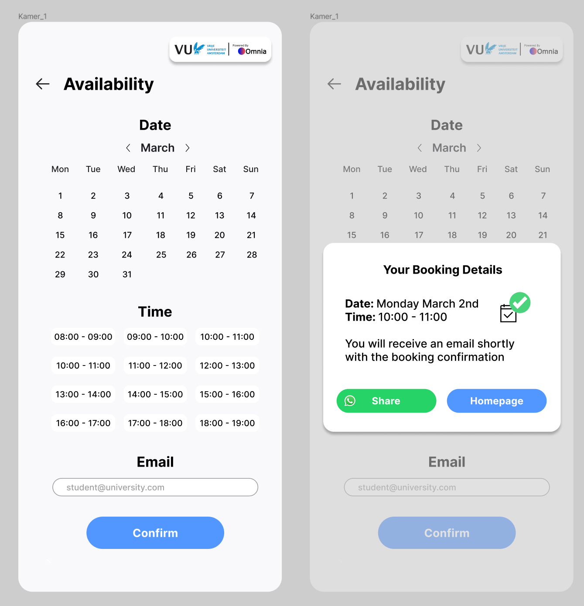

# Assignment: Room Booking Feature

## Introduction

Welcome to the Room Booking Feature assignment for front-end developer interns! In this task, you will be building a user-friendly room booking system using React and Next.js. The goal is to create a seamless experience with a calendar, time picker, and confirmation functionality.

## Task Overview

### Calendar and Time Picker:

- Users can only make single-day bookings.
- Users can only select a maximum of 2 timeslots that are next to eachother. For example: 10:00-11:00 and 11:00-12:00 can both be choosen. While 10:00-11:00 and 12:00-13:00 can not!
- Implement a calendar where users can select a specific date for their booking.
- Create a time picker that allows users to choose from predefined time slots.
- Call an API to check availability for the selected date and time.
- A mock API has been developed and can be accessed using the following URL: https://rzssj8nj3c.execute-api.eu-central-1.amazonaws.com

### Email Validation:

- Prompt users to enter their email.
- Check if the email ends with "@vu.nl."
- If the email is not valid, display a user-friendly error message.

### Confirmation Popup:

- Upon successful validation, show a confirmation popup.
- Display the selected date, time, and user's email in the popup.
- The Whatsapp share button is not mandatory. 

## Styling and Design

### Overall Styling:

- Refer to the provided design for styling requirements.
- You can use libraries and packages for styling if it enhances the design.

### Creativity:

- Apply creativity to the overall application, including the design and user interface.

### Responsive Design:

- Ensure that the application is responsive for smartphone and tablet.

## Submission Guidelines

- **GitHub Repository:**
  - Share your finished assignment by providing a link to your GitHub repository.

- **Deadline:**
  - The deadline for completing and submitting the assignment is 13th of Februari 2024.

## Additional Notes

- **Creativity:**
  - We encourage creativity! Feel free to add your touch to the design and implementation.

- **Testing:**
  - Focus on basic functionalities; thorough testing is not required for this assignment.

- **Feedback:**
  - Submit what you have, even if its not finished or does not look exactly like the design in the image above! 

Good luck, and we look forward to seeing your creativity in action!
